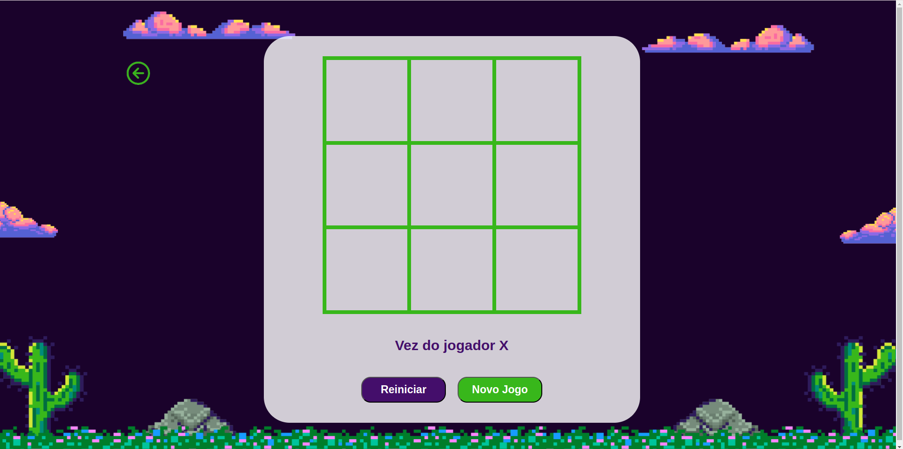
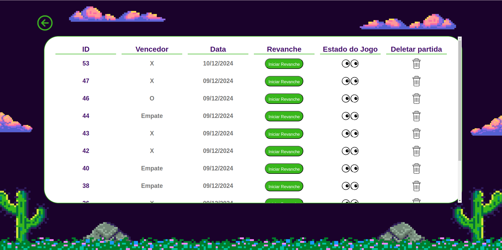

# Jogo da Velha - Backend
Este é a API backend para "Jogo da Velha", desenvolvido com Ruby on Rails. O backend é responsável por gerenciar o estado do jogo, armazenar e manipular os dados das partidas.

## Funcionalidades 
  - Gerenciamento de requisições.
  - Gerencia o estado do jogo, verifica se as jogadas são válidas e armazena os dados no Banco de Dados.
  - Contém as seguintes actions:
    - Create: salvar o jogo no banco com quem ganhou (X ou O), e quando foi jogado
    - Read: conseguir mostrar quem venceu o jogo, a data e (bônus) mostrar como ficou a tabuleiro
    - Update: rematch do jogo, ou seja, que o jogo tenha uma revanche
    - Delete: apagar o jogo do histórico

## Tecnologias Utilizadas
 - Ruby on Rails: Framework Ruby para o backend.
 - PostgreSQL: Banco de Dados.
 - Docker: Rodar o banco de dados.
 - RSpec: Biblioteca para testes unitários.

## Como rodar a aplicação
Como rodar o Projeto:

  1. Clone o repositório:
     ```bash
     git clone https://github.com/LuMedeir/Jogo_da_Velha-backend.git
     cd jogo-da-velha-backend
     ```
  3. Instale as dependências:
     ```bash
     bundle install
     ```
  5. Migrate as tabelas do banco de dados:
     ```bash
     rails db:create db:migrate
     ```
  6. Suba o container do PostgreSQL e rode o servidor usando o Makefile:
     ```bash
     make up
     ```

## Como rodar os testes
  1. Digite o seguinte comando:
     ```bash
     make test
     ```
     
## Principais endpoints da API

### `GET /games`
- Retorna o histórico de jogos.
- Exemplo de requisição:
  ```bash
  curl http://localhost:3000/games
  ```
- Resposta esperada:
  ```json
  [
    {
      "id": 1,
      "winner": "X",
      "game_state": ["X", "O", "X", "O", "X", "O", "O", "X", "O"],
      "created_at": "2024-12-12T00:00:00Z",
      "updated_at": "2024-12-13T00:00:00Z"
    },
    {
      "id": 2,
      "winner": "O"...
    }
  ]
  ```

### `POST /games`
- Cria uma nova partida.
- Exemplo de requisição:
  ```bash
  curl -X POST http://localhost:3000/games
  ```
- Resposta esperada:
  ```json
  {
    "id": 2,
    "winner": "",
    "game_state": ["", "", "", "", "", "", "", "", ""],
    "created_at": "2024-12-12T01:00:00Z",
    "created_at": "2024-12-12T01:00:00Z"
  }
  ```

### `GET /games/:id`
- Retorna o estado de um jogo específico.

```bash
curl http://localhost:3000/games/1
```
- Resposta esperada:
  ```json
  {
    "id": 1,
    "winner": "X",
    "game_state": ["X", "O", "X", "O", "X", "O", "O", "X", "O"],
    "created_at": "2024-12-09T18:56:12.481Z",
    "updated_at": "2024-12-10T18:48:28.295Z"
  }
  ```
### `DELETE /games/:id`
- Deleta um jogo pelo id.

```bash
curl -X DELETE http://localhost:3000/games/1
```

### `PATCH /games/:id/reset`
- Reinicia o jogo zerando todos os dados pelo id.
  ```bash
  curl -X PATCH http://localhost:3000/games/1/reset
  ```
- Resposta esperada:
  ```json
  {
    "id": 2,
    "winner": "",
    "game_state": ["", "", "", "", "", "", "", "", ""],
    "created_at": "2024-12-12T01:00:00Z",
    "created_at": "2024-12-14T16:50:12Z"
  }
  ```

## A interface do Jogo
Para ter acesso a interface do Jogo da Velha basta seguir o passo a passo do [frontend](https://github.com/LuMedeir/Jogo_da_Velha-frontend).

<p align="center">
 Partida:
 <br></br>
</p>

 <p align="center">
 Histórico de partidas:
 
</p>
